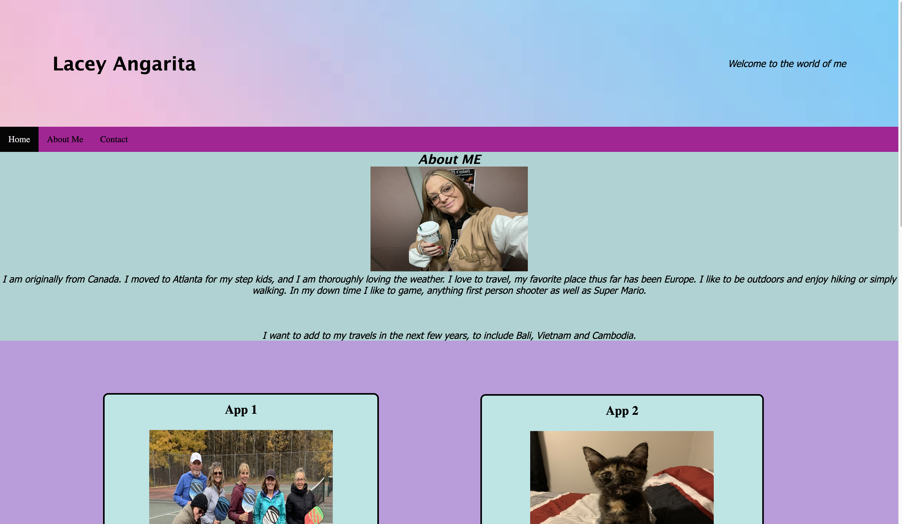

# welcome-to-moi

## User Story
I want to showcase my skills this far with a website showing all ive learned 

## The What 

To begin this project, I created a unique name and opened a folder. Once I brainstormed with wireframing I created a style sheet for my HTML. I wanted to show case my understanding this far in our program for employers to see. I created 3 apps, two of them having external links. My nav bar is fully functional and also have the ways to contact me at the bottom with external links as well. While basic, I enjoyed creating this project.

## Credit

Reference links :

https://www.gwinnettcounty.com/web/gwinnett/departments/communityservices/parksandrecreation/recreation/athleticrecreation/pickleball

https://kornofficial.com/

www.W3schools.com

